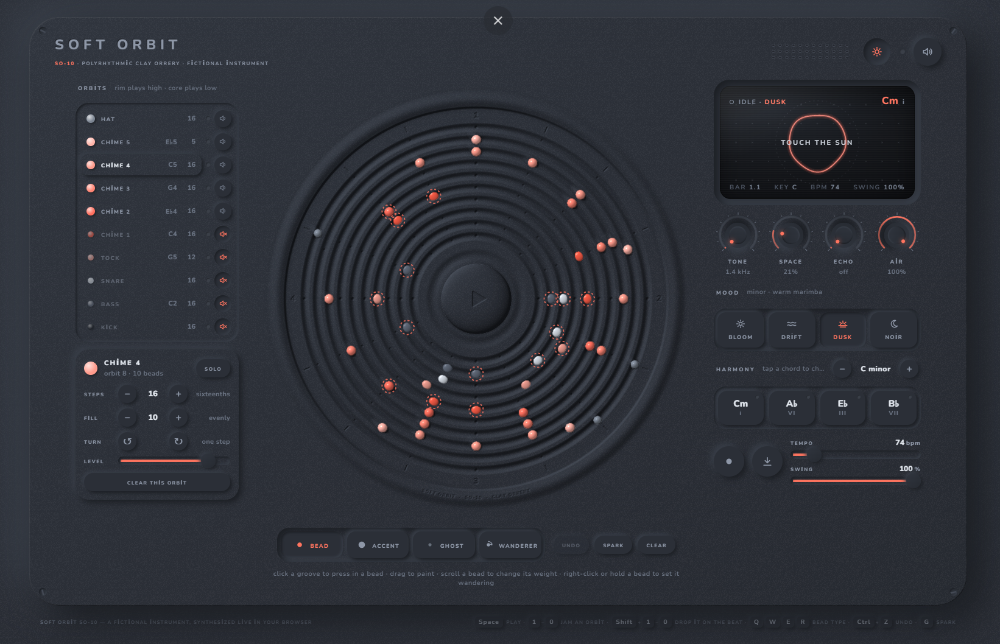

# Soft Orbit · SO-10

**A polyrhythmic clay orrery — make music by pressing beads into a living clay disc.**

▶ **Play it:** https://erenciracioglu-dotcom.github.io/soft-orbit/

Soft Orbit is a fictional instrument that runs entirely in your browser. Ten circular grooves are carved into one soft clay surface. Going around the disc is time (one turn is one bar); moving outward goes up in pitch — kick and bass at the core, chimes in the middle, hats at the rim. A sweeping light plays every bead it passes, and the clay ripples and glows with each hit.

## How to play

- **Press the sun** in the middle (or `Space`) to start.
- **Click a groove** to press in a bead, **drag** to paint a run, click a bead again to lift it out.
- **Scroll a bead** to make it louder or quieter.
- **Right-click or hold a bead** to make it a *wanderer* — it steps forward one slot every bar, so the pattern slowly evolves.
- **Mood:** bloom, drift, dusk, noir — each brings its own scale, chord progression and chime timbre. Tap a chord to change it; `−` / `+` changes key.
- **Orbits panel:** set the steps of each groove (12 = triplets, 5 = quintuplets…) for polyrhythms, spread beads evenly, turn a groove, mute or solo it.
- **Spark** (`G`) generates a fresh pattern · `Ctrl+Z` undoes · `1`–`0` jam a groove live · `Shift`+`1`–`0` drops it on the beat.
- **●** records a live take · **⤓** bounces 4 bars to a seamless loop WAV.
- The moon button switches to night clay.

## Under the hood

- One self-contained HTML file: no build step, no libraries, no server.
- The disc is a WebGL2 heightfield — grooves, beads and the sun button are rendered with raymarched soft shadows, ambient occlusion and a damped wave simulation for the ripples, lit to match the CSS neumorphic panel around it. A Canvas2D fallback covers machines without WebGL2.
- All sound is synthesized live with the Web Audio API: FM chimes, analog-style kick/snare/hats, a sawtooth bass and a ducked chord pad, through a generated reverb and ping-pong echo.
- The chimes follow the chord progression with smooth voice leading, so every bead lands in harmony.

## Run locally

Download `index.html` and open it in Chrome, Edge or Firefox. Your pattern is saved in the browser automatically.

## License

MIT
